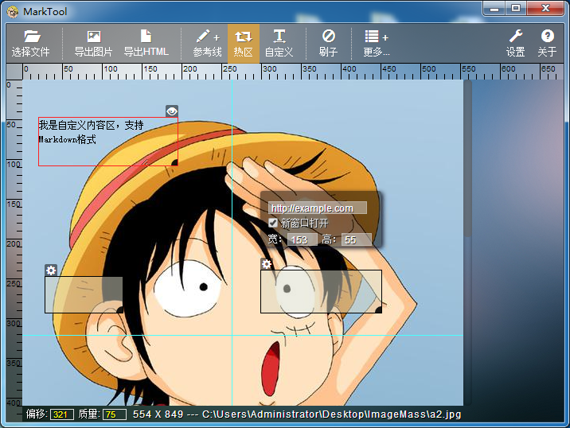

MarkTool2
==============

这个仓库是 [MarkTool](https://github.com/superRaytin/MarkTool) 的重构版本，基于 Atom-shell、React、Backbone

截图：

# License
本项目基于MIT协议发布

MIT: [http://rem.mit-license.org](http://rem.mit-license.org/) 详见 [LICENSE](/LICENSE) 文件
